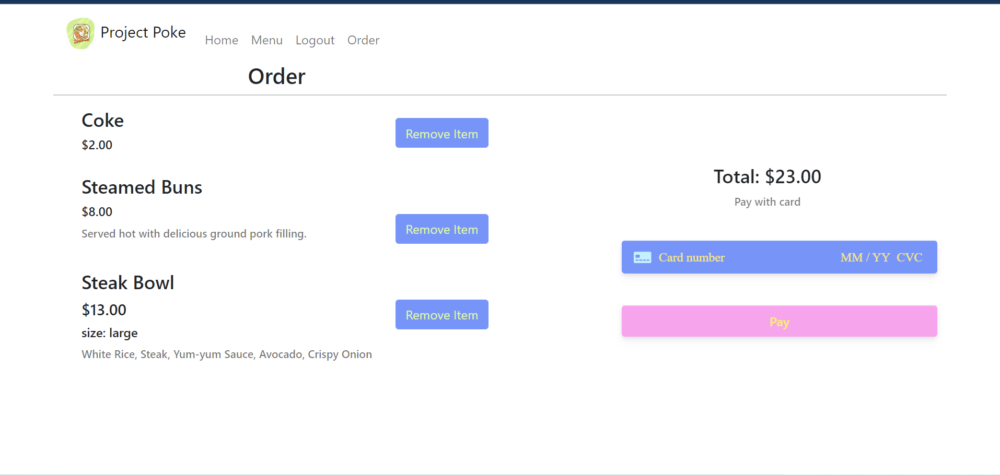

# Project 3: Project Poké Application

-----

## Welcome to the Project Poké Application!

-----

### Craving a delicious craft made Poké Bowl? Good news is Project Poké can help you put together a delcious order for a meal at your finger tips!

* To order, you will have to create an account on the website

    -without an account, User's can only view the menu

* After signing up, you will be redirected to the Menu page to start selecting desired dishes
* Choose from options of:

    -Premade Bowls

    -Create Your Own Bowl

    -Sides

    -Beverages

* Once selections have been chose, naviagte to the Order tab to review and process your payment
* Stripe is the payment functionality used for our application

    -Takes credit as a payment method

    -Will show red errors and alerts you when input fields are incomplete during payment process

    -For payments processed, and notification will pop up alerting you the transaction was successful with a link to redirecting back to the home page

----
----

[Heroku Live Link](https://tranquil-castle-29813.herokuapp.com/)

----

[GitHub Repository Link](https://github.com/midth002/project-poke)

----
----

# Project Poké Images

---

## Home Page

---

## Signup/Login Page

---

## Menu Page

---

## Order Page

